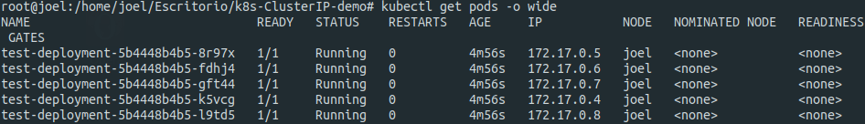
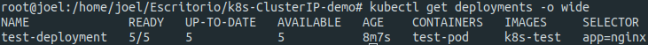
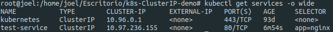

# k8s-ClusterIP-demo
Simple k8s project that shows which of the pods in a ClusterIP answers a request from the user.

First step is elaborating a new Dockerfile based in nginx:alpine which will replace and write the container hostname inside the index.html file (as this container will be replicated 5 times, the hostname will be the pod name):

```
FROM nginx:alpine

EXPOSE 80

CMD nginx
&& rm -rf /usr/share/nginx/html/index.html
&& touch /usr/share/nginx/html/index.html
&& echo "<h2>Hello, your request has been replied by pod with name $HOSTNAME</h2>" >> /usr/share/nginx/html/index.html
&& exec /bin/sh -c "trap : TERM INT; (while true; do sleep 1000; done) & wait"
```

Then we build this Dockerfile and rename it with name "k8s-test":

```
docker build .
docker tag (IMAGE_ID) k8s-test
```

Next step is creating a kubernetes manifest (test.yaml) consisting of one deployment and one ClusterIP service:

```
apiVersion: apps/v1
kind: Deployment
metadata:
  name: test-deployment
  labels:
    app: nginx
spec:
  replicas: 5
  selector:
    matchLabels:
      app: nginx
  template:
    metadata:
      labels:
        app: nginx
    spec:
      containers:
      - name: test-pod
        image: k8s-test
        imagePullPolicy: IfNotPresent
        ports:
        - containerPort: 80
---
apiVersion: v1
kind: Service
metadata:
  name: test-service
spec:
  type: ClusterIP
  selector:
    app: nginx
  ports:
    - protocol: TCP
      name: http
      port: 80
      targetPort: 80

```

This manifest declares a deployment called "test-deployment", consisting of 5 replicas of a pod with name test-pod-x based on the k8s-test image we built from our Dockerfile, and exposes all of them on port 80 (http) with the label app:nginx.
After that, the manifest declares a service called "test-service" with the type ClusterIP and a selector for the app:nginx which forwards ports from port 80 in each pod to port 80 in the service.

Next step is applying this manifest:

`kubectl apply -f test.yaml`

As we can see in the next images, every pod, deployment and service has been created correctly.

**Pods:**



(If you try entering the IP of any pod in your browser you can check that the message is given correctly for each pod with its own hostname)

**Deployment:**



**Service:**




Finally if we introduce the service IP address in our browser, we will see our request will be answered by any of the pods of the deployment. Try requesting from different browsers or devices and the pod answering the request will be different each time.
